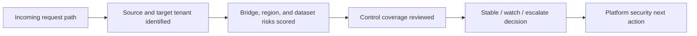
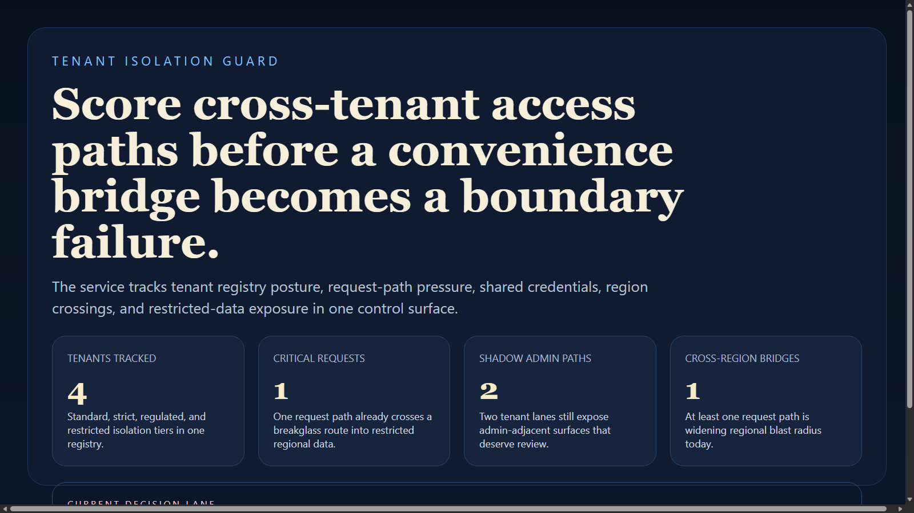
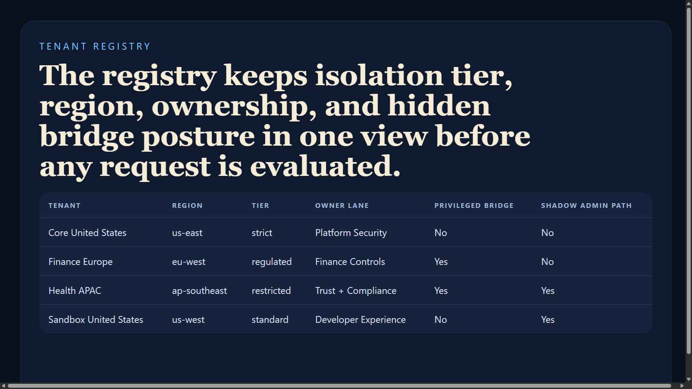
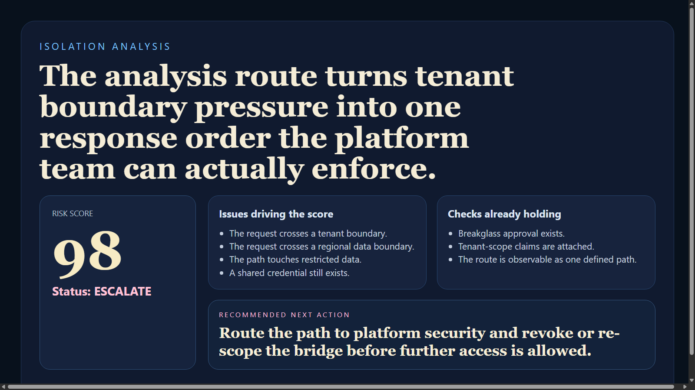
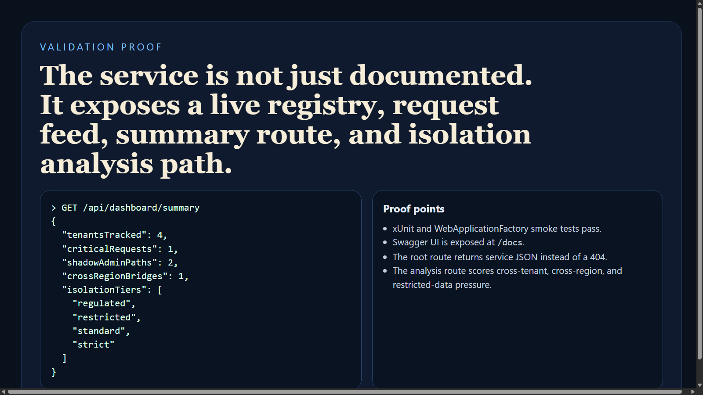

# Tenant Isolation Guard

Tenant Isolation Guard is a C# and ASP.NET Core service for evaluating tenant-boundary safety, cross-tenant access risk, and privileged path expansion. It treats multi-tenant isolation as an operational control problem instead of a vague platform assumption.

## Executive Summary

This project models tenants, request paths, ownership lanes, and tenant-boundary incidents in one backend service. It exposes a registry, a request review feed, a summary endpoint, and an analysis route that scores whether a request should stay stable, remain under watch, or be escalated.

## Portfolio Takeaway

- enterprise-flavored C# backend with platform and security posture framing
- tenant boundary evaluation instead of generic auth boilerplate
- request risk scoring with ownership and remediation guidance
- tests, Swagger docs, CI, and real PNG proof assets

## Overview

| Area | Details |
| --- | --- |
| Language | C# |
| Framework | ASP.NET Core 8 |
| API Docs | Swagger UI at `/docs` |
| Test Stack | xUnit, WebApplicationFactory |
| Core Domains | tenants, request paths, isolation tiers, cross-tenant risk |
| Runtime Shape | In-memory registry plus analysis service |

## API Surface

- `GET /`
- `GET /health`
- `GET /api/tenants`
- `GET /api/requests`
- `GET /api/requests/{requestId}`
- `GET /api/dashboard/summary`
- `POST /api/analyze/isolation`
- `GET /docs`

## Request Flow



## Analysis Logic

The analysis route increases risk when a path:

- crosses a tenant boundary
- crosses a regional data boundary
- touches restricted data
- uses a shared credential
- travels through a privileged bridge
- carries an elevated admin role

It reduces the score slightly when meaningful controls such as `tenant-scope-claims`, `workload-identity`, and `breakglass-approval` are already attached.

## Sample Analysis

Request:

```json
{
  "sourceTenantId": "tn-core-us",
  "targetTenantId": "tn-health-apac",
  "callerRole": "platform-admin",
  "accessPath": "ops-breakglass",
  "hasSharedCredential": true,
  "hasPrivilegedBridge": true,
  "crossesRegionBoundary": true,
  "touchesRestrictedDataset": true,
  "existingControls": [
    "tenant-scope-claims",
    "breakglass-approval"
  ]
}
```

Response:

```json
{
  "status": "escalate",
  "score": 98,
  "issues": [
    "The request crosses a tenant boundary.",
    "The request crosses a regional data boundary.",
    "The path touches restricted data that should not move laterally.",
    "A shared credential still exists in the request path.",
    "A privileged bridge can widen the blast radius if the path is abused.",
    "The caller role carries elevated administrative capability."
  ],
  "passedChecks": [
    "Multiple meaningful controls already reduce path expansion risk."
  ],
  "recommendedNextAction": "Route the request path to platform security and revoke or re-scope the bridge before further access is allowed."
}
```

## Screenshots

### Control Room


### Tenant Registry


### Isolation Analysis


### Validation Proof


## Run Locally

```powershell
cd tenant-isolation-guard
dotnet run --project TenantIsolationGuard.Api --urls http://127.0.0.1:5108
```

Then open:

- `http://127.0.0.1:5108/`
- `http://127.0.0.1:5108/docs`

## Validation

```powershell
cd tenant-isolation-guard
dotnet test TenantIsolationGuard.sln
dotnet build TenantIsolationGuard.sln -c Release
```

## Tech Stack

[](https://dotnet.microsoft.com/)
[](https://learn.microsoft.com/aspnet/core)
[](https://swagger.io/specification/)
[](https://xunit.net/)

## Portfolio Links

- [Kinetic Gain](https://kineticgain.com/)
- [LinkedIn](https://www.linkedin.com/in/mirzacausevic)
- [Skills Page](https://mizcausevic.com/skills/)
- [Medium](https://medium.com/@mizcausevic)
- [GitHub](https://github.com/mizcausevic-dev)
