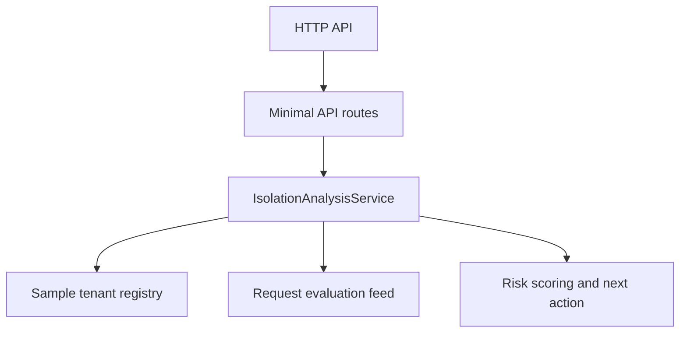

# Architecture

Tenant Isolation Guard is structured as a lightweight ASP.NET Core service with a focused in-memory domain model for tenant registry, request evaluation, and escalation guidance.

## Components

## Domain Objects

- `TenantProfile`
- `RequestEvaluation`
- `DashboardSummary`
- `IsolationAnalysisInput`
- `IsolationAnalysisResponse`

## Why This Shape Works

The service stays grounded as a backend artifact. It models boundary checks, ownership, and escalation clearly without pretending to be a full IAM system or policy engine runtime.
